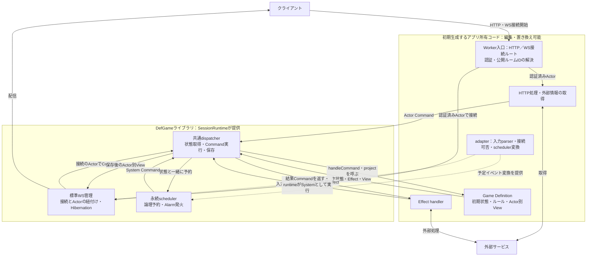
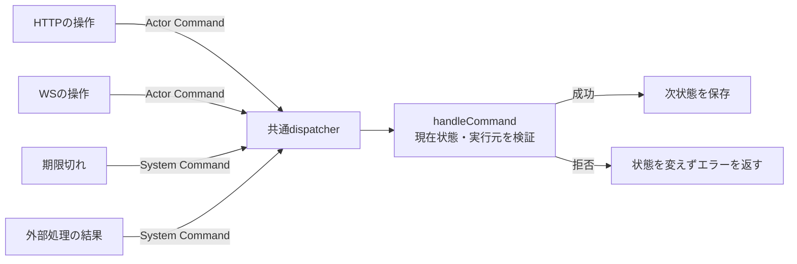
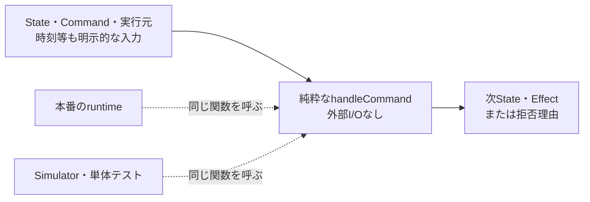
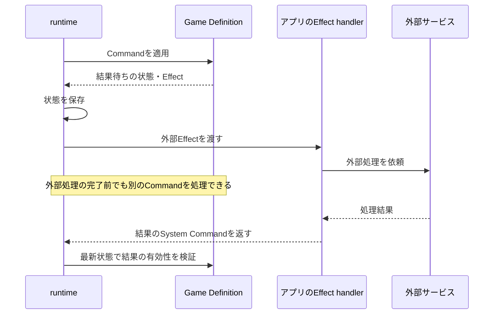
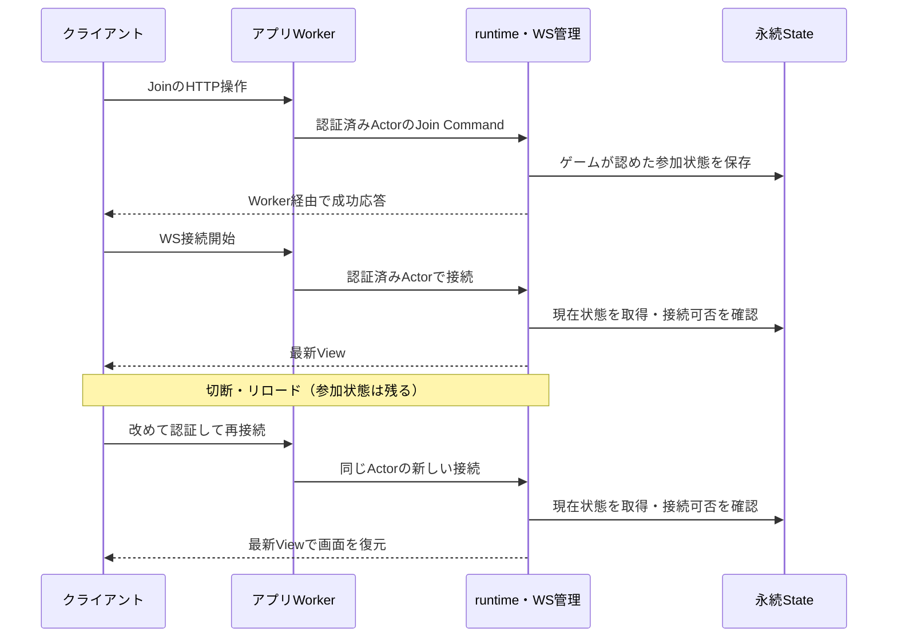
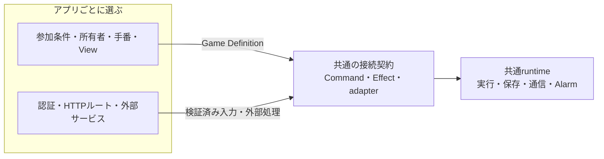

# DefGameでゲームを作る

DefGameは、ゲームルールを純粋な状態機械として定義し、保存・通信・外部サービスにつなぐTypeScriptライブラリです。
あなたが実装するのは、ゲームの状態とルール、プレイヤーに見せる情報、アプリ固有の外部処理です。
ルームの保存、Commandを実行する共通手順、WebSocketの接続管理、Alarmはライブラリが担当します。

このガイドは、ゲームを実装する人とAIエージェントに向けて、実装する順序とその理由を説明します。
前半を読みながら最小のゲームを作り、後半で設計の判断基準を確認してください。
型・戻り値・エラー・通信形式の詳細は[runtime API](runtime-api.md)にまとめています。

## 全体像：アプリが決めること、runtimeに任せること



枠は**コードの所有と責務の境界**です。別々のサービスとしてデプロイするという意味ではありません。
Game Definitionやadapter・Effect handlerも、runtimeから呼ばれるときはDO内で動きます。
WS接続後のメッセージはライブラリのWS処理へ届き、毎回Worker入口で認証し直す構成ではありません。
アプリのコードは生成後に編集できます。runtimeの共通実装は依存パッケージとして利用します。

## 1. init-workerで開発を始める

Node.js 22以降で、次を実行します。以下は`6.2.0`の利用手順です。

```sh
npx def-game@6.2.0 init-worker --directory my-game --name my-game
cd my-game
npm install
npm run dev
```

`http://127.0.0.1:8787`を開くと、2人がデッキを選び、1枚ずつカードを出す最小ゲームを試せます。
別のブラウザープロファイルで共有URLを開けば、別Actorとして参加できます。
未公開の開発版を使う場合の導入方法は[runtime APIの初期生成手順](runtime-api.md#初期生成とローカル開発)を参照してください。

生成先には、すでにruntimeへ接続されたアプリができます。

| ファイル | あなたが実装・変更すること |
| --- | --- |
| `src/game/types.ts` | ゲームのState・Command・View・Effect・Errorの型 |
| `src/game/definition.ts` | 初期状態、ルール、状態遷移、Actor別View |
| `src/game-adapter.ts` | WS入力の変換、接続可否、Alarm・外部Effectの接続 |
| `src/external/` | デッキ取得などの外部ドメイン処理 |
| `src/index.ts`、`src/auth.ts` | HTTPルート、認証、公開ルームIDの解決 |
| `src/room.ts`、`wrangler.jsonc` | 共通runtimeとCloudflare DOの登録 |
| `public/` | Viewを描画し、ユーザー操作を送る画面 |

**生成されたコードは、すべてあなたのアプリのコードです。**
最小ゲームを自分のゲームへ置き換え、認証やルートも必要に応じて変更してください。
ライブラリを更新するときは依存パッケージを更新します。アプリを再生成して編集内容を上書きする運用にはしません。

## 2. まずゲームの状態とルールを書く

最初に編集するのは`src/game/types.ts`と`src/game/definition.ts`です。
画面のボタンや通信処理を考える前に、「今どの状態で、誰のどんな操作によって、次にどうなるか」を表現します。

### ゲームが扱う情報を決める

| 型 | 考えること | カードゲームの例 |
| --- | --- | --- |
| State | 再開に必要なゲームの事実 | 参加者、手札、手番、選択待ちのID |
| Actor Command | 認証済み利用者が行う操作 | 参加する、デッキを選ぶ、カードを出す |
| System Command | 信頼されたサーバー側からの入力 | 期限切れ、外部処理の完了 |
| View | そのActorに見せてよい情報 | 自分の手札、公開得点、availableActions |
| Effect | ゲームの進行から必要になった外部処理の宣言 | 期限を予約する、結果を外部へ送る |
| Error | ゲームとして操作を拒否する理由 | 手番ではない、カードを持っていない |

Stateの内部構造はゲームが決めます。ライブラリが参加者や所有者のフィールドを要求することはありません。
最初から所有者がいるゲームも、マッチングで参加者が決まるゲームも、自分のルールとして表現してください。

### Game Definitionの3つの関数を実装する

| 関数 | 実装すること |
| --- | --- |
| `createInitialState()` | 空のルームに保存できる初期状態を返す |
| `handleCommand(state, command, context)` | 実行者と現在状態を検証し、次状態とEffect、または拒否理由を返す |
| `project(state, actorId)` | そのActor向けのViewを返す |

例えば、手番中のカード選択を処理する分岐は次のようになります。これは構造を示す抜粋です。

```ts
// handleCommand内の「カードを出す」処理
if (context.origin !== 'actor' || context.actorId !== state.currentActorId) {
  return { ok: false, error: 'not-your-turn' };
}

// カードの所有、対象の選択待ちIDなども検証する
return {
  ok: true,
  state: nextState,
  effects: [],
};
```

`handleCommand`では入力Stateを変更せず、新しい状態を返します。
DB保存、fetch、WebSocket送信は行いません。時刻や乱数が必要なら、信頼できる実行側で作りCommand等に明示的に載せます。
同じState・Command・実行元からは、同じ結果が返るようにします。

ルーム作成は`createInitialState()`の保存で完了します。作成にActorや最初のCommandは必須ではありません。
Joinや設定変更は、その後のゲームCommandとして実装してください。
「部屋を作った人が所有者になる」というルールも、ライブラリではなくゲームが決めます。

`project`では、自分の手札などActorに公開できる情報だけを返してください。
HTTPで部屋の概要や再読み込み用の情報を取得したい場合は、`room.getView(actor)`を使います。
同じprojectが呼ばれるので、未参加者には要約、参加者には個別情報という出し分けもここで実装します。WSの接続資格は要求しません。
`availableActions`は画面を作るための補助です。ボタンを非表示にしても不正なCommandは送れるため、操作可否は必ず`handleCommand`でも検証します。

## 3. ゲームと外部を接続する

ゲームルールができたら、HTTPやWebSocketで受けた操作、外部サービスの情報をつなぎます。
ここで守る中心原則は、**外部からゲームへはCommand、ゲームから外部へはEffect**です。

### 利用者の操作に必要な情報を、アプリで取得する

例えば「自分のデッキを選ぶ」操作では、HTTPルートが認証とデッキ取得を行い、取得結果をCommandに含めます。

```ts
// actorは認証済み、deckIdはリクエストから検証済みの値
const deck = await loadDeck(actor.actorId, deckId);
const result = await room.dispatchActor(actor, {
  type: 'select-deck',
  deck,
});
```

これは利用者の操作なので、外部取得が挟まってもActor Commandです。
アプリは本人確認や外部デッキへのアクセス権を確認し、ゲームは最新状態で「今デッキを変更できるか」を判断します。
取得を待っている間にゲームが始まったなら、ゲーム側で変更を拒否できます。

`actorId`やSystem権限を、リクエスト本文の自己申告から作らないでください。
また、外部カタログから取得すべき能力値を、クライアントが自由に指定できる入口を作ってはいけません。
WS parserはクライアントが指定できる入力だけを許し、サーバー取得用のCommandと区別します。
手番等のゲームルールをparserに重複実装する必要はありません。

### ゲームの進行に必要な外部処理を、Effectで依頼する

結果保存や外部処理の依頼がゲームの進行から発生するなら、`handleCommand`がEffectを返します。
アプリの`executeEffect`がそれを実行し、結果をゲームへ戻す場合は`{ command: ... }`を返します。
runtimeがそのCommandをSystem起点で再び実行します。

```text
Command
  → ゲームが次状態とEffectを返す
  → runtimeが状態を保存
  → アプリのEffect handlerが外部処理
  → 必要ならSystem Commandを返す
  → ゲームが最新状態で結果を検証
```

Effect handlerからstorageやゲーム状態を直接変更しないでください。
結果待ちがある場合は、処理IDや待機状態をStateに保存します。古い結果が戻っても、今のゲームに適用してよいか判断できるようにします。
System Commandもルールの検証を省略する入口ではありません。

webhookやマッチング処理から入力する場合は、アプリで認証と呼び出し権限の確認を済ませてから、必要に応じて`getSystemRoom(...).dispatchSystem(...)`を使います。

## 4. adapterで共通runtimeにつなぐ

`src/game-adapter.ts`は、ゲームとアプリの関数をruntimeへ渡す接続点です。
生成済みのadapterを、自分の型とルールに合わせて変更してください。

| adapterの項目 | 必要になる場面 | 実装内容 |
| --- | --- | --- |
| `game` | 必須 | 作成したGame Definitionを渡す |
| `webSocket.parseCommand` | 必須 | unknownの入力を許可したActor Commandへ変換。拒否はnull |
| `canConnect` | 必須 | StateとActor IDから接続・View配信の可否を判定 |
| `scheduler.effect`／`scheduler.command` | 予定イベントを使う場合 | Effectから論理予約への変換と、発火時のSystem Command作成 |
| `executeEffect` | 外部Effectを出す場合 | 外部処理と、必要なら結果Commandの返却 |
| `onError` | 独自の診断が必要な場合 | 失敗した区間の記録・通知 |

`executeEffect`は型上は省略可能ですが、外部Effectを出すゲームでは対応するhandlerが必要です。
scheduler用Effectはruntimeが状態と一緒に保存します。外部handlerから直接setAlarmする構成にはしません。

`src/room.ts`では、そのadapterを共通runtimeへ接続しています。

```ts
export class RoomDurableObject extends SessionRuntime<Env, Types> {
  protected readonly adapter = adapter;
}
```

ゲームごとに状態保存やWSの受信処理を複製する必要はありません。
DOクラスのexportとWranglerの登録は生成済みです。名前を変更する場合は登録側も揃えてください。adapterの変数名とは独立しています。

参加はゲームCommand、WS接続は通信の操作です。
HTTPでJoinが成功した後にWSを接続できます。接続に失敗しても保存済みの参加状態は残り、再接続で最新Viewを受け取れます。
接続とActorの紐付けのために、別のゲーム状態更新を追加する必要はありません。

## 5. 動かしながらゲームを育てる

ルールの確認は、まず`GameSimulator`へCommandの列を渡して行います。

```ts
import { GameSimulator } from 'def-game';
import { game } from './src/game/definition.js';

const simulator = new GameSimulator(game);
const result = simulator.executeCommand(
  { type: 'join', name: 'Alice' },
  { origin: 'actor', actorId: 'alice' },
);
const view = simulator.getView('alice');
```

成功する操作に加えて、手番外の操作、古い選択待ちID、拒否後に状態が変わっていないことを確認してください。
Simulatorは外部サービスを実行する仕組みではありません。Effectの内容を確認し、結果を模したSystem Commandを次の入力として渡せます。

その後、生成アプリで通信込みの動作を確認します。

```sh
npm run typecheck
npm run build
npm run dev
```

`build`はWranglerのdry-runで、公開デプロイは行いません。
ローカル開発の認証、公開環境での認証設定、起動手順の詳細は[runtime API](runtime-api.md#初期生成とローカル開発)を参照してください。

機能を追加するときも、この順序を繰り返します。
入力をCommandとして定義し、ルールとViewを実装してから、必要な外部処理と画面をつなぎます。
AIエージェントへ実装を依頼する場合も、変更するState・Command・Effect・Viewと、その責務の置き場所を先に明らかにしてください。

## ライブラリは何を担い、どんな課題を解決するか

### 状態変更の入口を揃え、ゲームを追えるようにする



HTTP、WS、予定イベント、外部処理の完了がそれぞれ直接状態を書き換えると、どこにルールがあるのか追いにくくなります。
DefGameでは初期状態の生成後、すべてのゲーム操作をCommandとして`handleCommand`へ集めます。
同じ操作なら通信経路によらず同じルールを通り、変更理由をCommandとその処理から読めます。
これは状態遷移の構造を揃える仕組みであり、Command履歴の永続保存や自動リプレイを提供するものではありません。

### 純粋な状態機械にして、ゲームを単独で考えられるようにする



ゲームを「現在状態と入力から、次状態を計算するもの」にすると、HTTPサーバーやDBなしでルールを実行できます。
時刻・乱数・外部情報も入力として明示することで、同じ条件の再現と、境界条件のテストがしやすくなります。
Cloudflare非依存の`GameDefinition`と`GameSimulator`は、このための契約と実行手段です。

1回のCommandでは、次の入力を待てる状態まで進めます。
「誰の回答待ちか」「どの処理結果待ちか」をStateに表し、休止後も再開できるようにしてください。
ゲーム進行を、未来の処理を積んだ永続Task Queueに隠す設計は採りません。

### 副作用を分離し、外部サービスとの接続を変更しやすくする



図は成功時の流れです。保存から外部処理・結果の反映までの配送を一体で保証するものではありません。

ゲームがEffectを宣言し、アプリが実行することで、ルールから外部APIのURL・認証・DB実装を切り離せます。
外部サービスを変更しても、CommandとEffectの意味が同じならゲームルールを保てます。
ルール単体のテストでは外部サービスを呼ばず、実際の接続は別の統合テストで確認できます。

ただし、外部Effectはbest effortです。状態保存後、handlerが起動する前に停止すれば依頼が失われる可能性があります。
外部処理の完了から結果Commandの保存までにも同様の隙間があります。
ライブラリは永続outboxや自動再試行を提供せず、Effect失敗で保存済み状態を取り消しません。
結果が必須の機能では、アプリ側の復旧方法やゲーム側の予定イベントを設計してください。

### 保存・Alarm・配信の手順を共通化する

```mermaid
flowchart TB
  Input["プレイヤーの操作"] --> G["handleCommand"]
  G --> Wait["安定した入力待ち状態<br/>誰の入力・どのdecision IDを待つか"]
  G --> Effect["scheduler用Effect<br/>イベントID・期限"]
  subgraph TX["同じstorage transactionで確定"]
    State["入力待ち状態を保存"]
    Reservations["N個の論理予約を保存"]
    Alarm["最も早い期限を<br/>1つの物理Alarmへ設定"]
    Reservations -->|min(deadline)| Alarm
  end
  Wait --> State
  Effect -->|adapterで識別| Reservations
  TX --> Saved["保存確定"]
  Saved --> View["View配信"]
  Saved --> Waiting["次の入力を待つ"]
  Waiting -->|期限前の操作| Next["Actor Command"]
  Waiting -->|Cloudflare Alarm発火| Scheduled["System Command<br/>イベントIDを付ける"]
  Next --> Check["同じhandleCommand<br/>現在の入力待ちに有効か検証"]
  Scheduled --> Check
  Check -->|有効| Transition["次の安定状態へ<br/>必要なら予約を取消・更新"]
  Check -->|古い入力等| Reject["現在状態を進めない"]
```

手番や選択待ち、inactivity、再接続猶予などに期限を付けるとき、ゲームは「期限に達したら何をするか」を実装します。
複数の論理予約の保存とCloudflareネイティブの1つのAlarmへの接続はruntimeに任せられます。
runtimeはイベントIDの意味を解釈せず、最も早い期限だけを物理Alarmへ設定します。
図のtransactionは保存処理だけを囲んでいます。将来の発火・Command実行や、取り消せないView配信は含みません。

複数の入力が届いても、runtimeが状態取得から更新を直列化し、状態と論理予約を同じtransactionで保存します。
これにより、ゲームごとに同じ排他制御や保存手順を実装する負担を減らします。
保存が確定してからViewを配信し、外部Effectは直列化区間を出て実行します。
外部処理を待っている間にも次のCommandを処理し、結果が戻れば最新状態に対して検証します。

Alarm発火時は期限に達した予約を1件ずつ通常のCommandとして処理し、そのたびに最新のStateと予約を読み直します。
先のCommandがゲームを終了して次の予約を取り消せば、その予約は処理されません。
論理予約が状態と一緒に確定することと、将来のAlarm発火が一度だけ処理されることは別です。
ゲーム側でもイベントIDと現在状態を確認し、古い入力を適用しないようにします。

### ゲームの参加状態を、通信の寿命から切り離す



この図は切断後の再接続です。HibernationだけならWS接続を維持したままDOが休止・復帰するため、別の流れです。

接続が切れたことだけでゲームの参加状態を失う必要はありません。
runtimeはゲーム状態をstorageに保存し、WS接続とActorの対応を別に管理します。
標準WSはHibernation APIを使い、同じActorの複数接続に対応します。再接続時は最新Viewを送り、切断中のイベント再生には依存しません。

本人確認は接続開始時にアプリが行います。接続中は各メッセージで認証トークンを再検証せず、再接続時に改めて認証します。
ゲーム上の参加資格や操作可否は、それとは別に最新Stateで判断します。
通信方式全体の差し替えや、トークン失効に連動した自動切断は標準runtimeの提供範囲に含みません。

### ゲーム固有の選択を、アプリに残す



ライブラリは所有者モデル、参加条件、手番の表現、公開URL、外部ドメインの保存方式を決めません。
生成例では推測困難なルームIDを共有してアクセスし、Actorは別途認証する形を採っていますが、公開入口の設計はアプリで変更できます。
認証や外部処理を変更するときも、ゲームには検証済みの実行元とCommandを渡す契約を保ってください。

DefGameが揃えるのは、状態遷移と外部処理の境界です。
その境界の内側でどんなゲームを作るか、外側でどんなサービスと組み合わせるかは、あなたが決めます。
